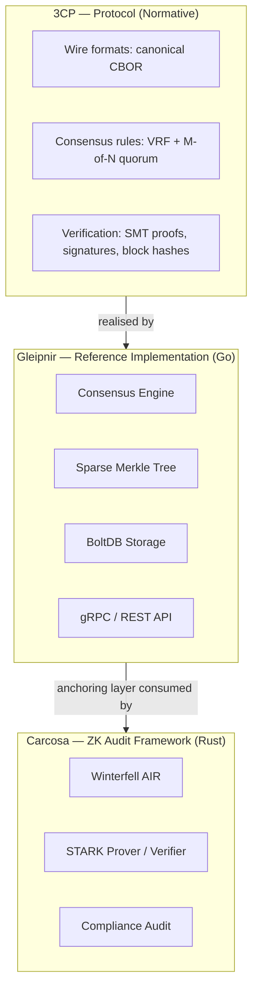
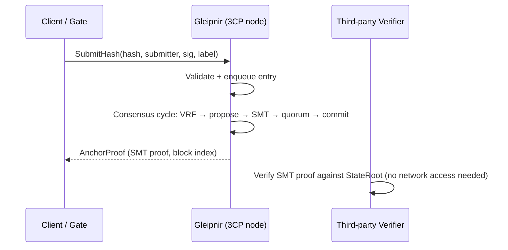

# Architecture Overview

> **Document Level:** B — Architectural
>
> **Classification:** Informative
>
> **Status:** Draft
>
> **Version:** 1.0
>
> **Source**
> - Specification: [`spec/3CP.md`](../../spec/3CP.md) §1–§9
> - Implementation: `gleipnir-ipc/pkg/`, `carcosa/air/`, `carcosa/cli/`
> - Reference: [`CARCOSA.md`](../../CARCOSA.md), Gleipnir `docs/BLUEPRINT.md`

---

## Purpose

Describe the end-to-end architecture of the 3CP ecosystem and the trust
boundaries between its three layers, so that a reader can locate any subsystem
within the whole before reading its detailed document.

## Scope

The protocol layer (3CP), the reference implementation (Gleipnir), and the
coupled ZK audit framework (Carcosa). Detailed per-subsystem architecture is in
[Section 03](../03-gleipnir/architecture.md) (Gleipnir) and
[Section 04](../04-carcosa/architecture.md) (Carcosa).

## Layered Model

## Responsibilities and Trust Boundaries

| Layer | Responsibility | Trust boundary |
|-------|----------------|----------------|
| 3CP | Define *how* to anchor evidence with third-party-verifiable integrity | The specification is the normative boundary; the gRPC surface is the transport realisation (spec §2) |
| Gleipnir | Accept submissions, form consensus, produce and persist blocks | Validator signing keys (UID0) form the primary trust root; quorum protects against a minority of compromised operators (spec §12.1 A2) |
| Carcosa | Produce STARK proofs of policy compliance and anchor their digests via 3CP | Off-chain approver keys and the blob store are outside the chain; only the 32-byte proof digest crosses into 3CP |

## Data Flow (Anchoring)

The defining property: **verification does not depend on the producing node**
(spec §1). Any party holding a chain's blocks can independently verify every SMT
proof, signature, and block hash.

## Carcosa Coupling

Carcosa does not modify 3CP. It uses the existing anchoring API:

1. A STARK proof attests policy compliance (e.g. "≥2-of-3 authorised approvers
   signed") without revealing *who* signed.
2. `digest = BLAKE3(proof.bin)` (32 bytes) is anchored as a `ProvenanceEntry`.
3. The proof binary lives in an off-chain blob store; only the digest is on-chain.
4. A mandate makes omission of the proof detectable.

> **Implementation status (Carcosa):** Only the Winterfell AIR and CLI
> argument parsing are implemented. The prover, verifier, gRPC client, blob
> store, and audit logic are **not yet implemented**. See
> [Section 04](../04-carcosa/architecture.md). This overview describes the
> intended coupling; the "Behavior not yet verified" callouts in Section 04
> identify what is and is not built.

## Component-to-Document Map

| Subsystem | Normative spec | Implementation doc |
|-----------|----------------|--------------------|
| Consensus cycle | [consensus](../02-3cp-specification/consensus.md) | [engine](../03-gleipnir/engine.md) |
| State / SMT | [sparse-merkle-tree](../02-3cp-specification/sparse-merkle-tree.md) | [storage](../03-gleipnir/storage.md) |
| Cryptography | [cryptography](../02-3cp-specification/cryptography.md) | [engine](../03-gleipnir/engine.md) |
| VRF | [vrf](../02-3cp-specification/vrf.md) | [engine](../03-gleipnir/engine.md) |
| Transport / API | [networking](../02-3cp-specification/networking.md), [protobuf](../02-3cp-specification/protobuf.md) | [grpc-api](../03-gleipnir/grpc-api.md), [rest-api](../03-gleipnir/rest-api.md) |
| Mandates | [anchoring](../02-3cp-specification/anchoring.md) | *(not implemented in Gleipnir)* |
| ZK audit | — | [Carcosa](../04-carcosa/architecture.md) |

## Failure Domains

| Domain | Impact | Reference |
|--------|--------|-----------|
| Single validator loss | Quorum tolerates up to N−M failures | [incident-response](../05-operations/incident-response.md) |
| Network fragmentation | λ₁ below `MinLambda1` signals partition; nodes SHOULD fail closed (spec §12.3) | [observability](../05-operations/observability.md) |
| Storage corruption | Chain and SMT rebuild from BoltDB on boot | [disaster-recovery](../05-operations/disaster-recovery.md) |
| Signing key compromise | Custody problem, not protocol failure (spec §11.4, A3) | [security](../05-operations/security.md) |

## References

- [vision.md](vision.md) — goals and scope
- [threat-model.md](threat-model.md) — adversary model
- [`spec/3CP.md`](../../spec/3CP.md) — normative specification
- [Section 03](../03-gleipnir/architecture.md) — Gleipnir architecture
- [Section 04](../04-carcosa/architecture.md) — Carcosa architecture
