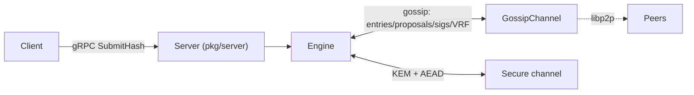

# 3CP Networking and Transport

> **Document Level:** C — Protocol
>
> **Classification:** Normative (transport) + Reference Implementation notes
>
> **Status:** Draft
>
> **Protocol Version:** 1
>
> **Version:** 1.0
>
> **Source**
> - Specification: [`spec/3CP.md`](../../spec/3CP.md) §2, §7
> - Implementation: `gleipnir-ipc/pkg/server/`, `pkg/transport/`, `pkg/transport/p2p/`
> - Tests: `pkg/transport/transport_test.go`, `pkg/server/api_test.go`

---

## Purpose

Define the canonical transport (gRPC) and the peer-to-peer networking model:
gossip, peer discovery, and the encrypted channel.

## Scope

Transport selection (spec §2), the gRPC service surface (spec §7; detailed in
[protobuf](protobuf.md)), and the reference implementation's peer networking.
Message payload structures are in [anchoring](anchoring.md).

## Canonical Transport (spec §2)

gRPC (Protocol Buffers over TCP) is the **canonical transport**. A conformant
peer MUST expose the 3CP gRPC service (spec §7). The message formats and
consensus rules are the normative boundary; gRPC is the transport that realizes
it. The choice MAY change if a superior transport emerges.

## gRPC Service Surface

The service exposes the methods in spec §7.1; see [protobuf](protobuf.md) for
message schemas and [Section 03 — gRPC API](../03-gleipnir/grpc-api.md) for the
implementation. Summary:

| Method | Purpose |
|--------|---------|
| `SubmitHash` | Submit a provenance hash; MUST authenticate the caller (§7.2.1) |
| `SubmitMandate` / `GetMandate` / `GetActiveMandates` | Mandate lifecycle (§7.5) |
| `WaitForAnchor` | Block until a hash is anchored; return proof + block index |
| `VerifyHash` | Check whether a hash is anchored |
| `GetCurrentStateRoot` | Return current SMT root |
| `GetHealth` | Node health (height, pending, λ₁, mandate count) |
| `GetBlock` / `StreamBlocks` | Retrieve / stream blocks |

## Peer-to-Peer Model (Reference Implementation)

> **Classification: Reference Implementation.** The specification defines the
> transport surface and consensus messages; the peer discovery and gossip
> mechanism below are Gleipnir-specific.

### Gossip

`GossipChannel` (`pkg/consensus/gossip.go`) abstracts entry, proposal,
signature, and VRF-proof dissemination. Two implementations:

| Implementation | Use | Location |
|----------------|-----|----------|
| `MemoryBus` | In-process (single-node, tests) | `pkg/consensus/gossip.go` |
| `GossipBus` (libp2p) | Multi-node | `pkg/transport/p2p/gossip.go` |

libp2p protocols: `/gleipnir/entries/1.0.0`, `/gleipnir/proposals/1.0.0`,
`/gleipnir/sigs/1.0.0`, with length-prefixed JSON framing.

### Peer Discovery

libp2p **mDNS** (service tag `gleipnir`) plus static `BootstrapPeers`
(`pkg/transport/p2p/gossip.go`).

### Encrypted Channel

`pkg/transport/secure_conn.go`: Kyber1024 KEM handshake → shared secret →
HKDF-SHA256 → ChaCha20-Poly1305 AEAD (`WriteMessage`/`ReadMessage`). See
[cryptography](cryptography.md) §3.

## Data Flow

## Failure Modes

| Failure | Symptom | Handling |
|---------|---------|----------|
| Peer unreachable | Missing gossip messages | Consensus continues if quorum met |
| mDNS unavailable | No auto-discovery | Fall back to `BootstrapPeers` |
| Handshake failure | No secure channel | Connection rejected |

## Implementation Divergence (Gleipnir)

> - The shipped `provenanced` daemon uses `MemoryBus` (single-node);
>   `GossipBus`/libp2p is **not wired** into `main.go`.
> - `PrivateKeyFile` loading for libp2p identity is a TODO in
>   `pkg/transport/p2p/gossip.go`.
> - `StreamBlocks` is declared but returns `Unimplemented`.
> - Mandate RPCs are absent (see [protobuf](protobuf.md)).

## References

- [`spec/3CP.md`](../../spec/3CP.md) §2, §7
- [protobuf](protobuf.md), [cryptography](cryptography.md)
- [Section 03 — gRPC API](../03-gleipnir/grpc-api.md),
  [REST API](../03-gleipnir/rest-api.md)
