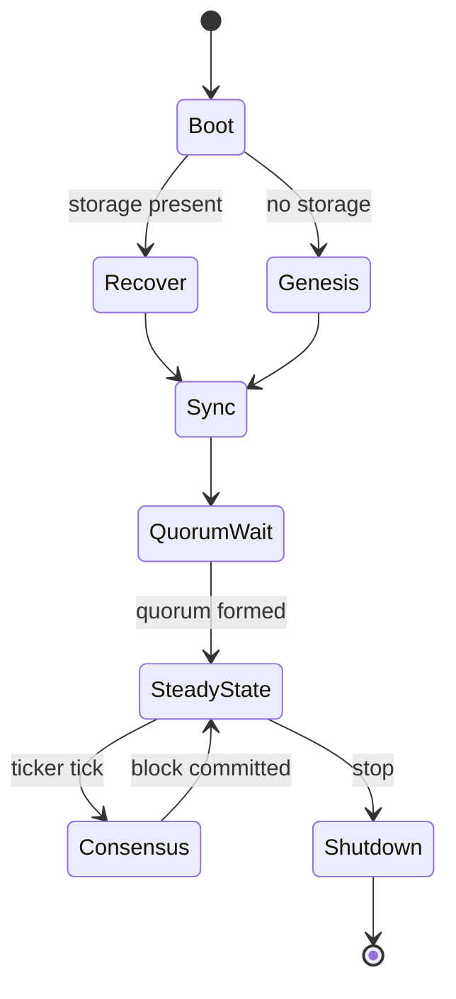
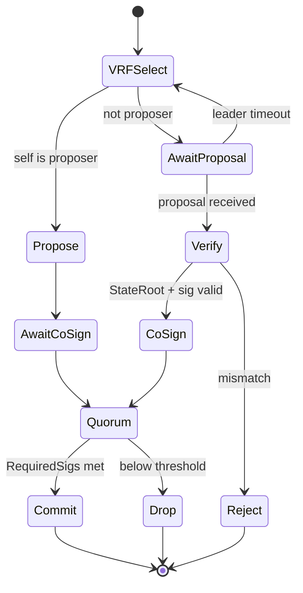

# 3CP Protocol State Machine

> **Document Level:** C — Protocol
>
> **Classification:** Normative
>
> **Status:** Draft
>
> **Protocol Version:** 1
>
> **Version:** 1.0
>
> **Source**
> - Specification: [`spec/3CP.md`](../../spec/3CP.md) §6
> - Implementation: `gleipnir-ipc/pkg/consensus/engine.go` (`cycleLoop`, `RunCycle`), `pkg/state/`
> - Tests: `pkg/consensus/consensus_liveness_test.go`, `consensus_multinode_test.go`

---

Per `DOCUMENTATION_SPEC.md` §17, this document provides the state list, events,
transitions, timeouts, and failure/recovery transitions.

## Purpose

Present 3CP as an explicit state machine spanning node boot, consensus per
cycle, and network state supervision.

## Scope

The protocol-level state machine. The consensus algorithm itself is in
[consensus](consensus.md); the Gleipnir engine view is in
[Section 03 — State Machine](../03-gleipnir/state-machine.md).

> **Note (spec §6):** The specification does not define an explicit enumerated
> phase machine (e.g. PROPOSE/VOTE/COMMIT). The states below are derived from
> the per-cycle sequence in spec §6 and the reference implementation's inline
> phases in `RunCycle`. Where a state is inferred rather than named in the spec,
> it is marked *(derived)*.

## Node Lifecycle States

| State | Description | Transition trigger |
|-------|-------------|--------------------|
| Boot | Process start, config parsed, identity loaded | — |
| Recover | Chain height recovered, SMT rebuilt from storage | storage present |
| Genesis | Fresh chain (empty state) | no storage |
| Sync | Peer discovery, missing-block synchronization | — |
| QuorumWait | Wait for `RequiredSigs` validators | quorum formed |
| SteadyState | Idle; heartbeats; awaiting ticker | ticker tick / stop |
| Consensus | One cycle (see below) | block committed |
| Shutdown | Persist and stop | stop signal |

## Consensus Cycle States (per tick)

| State | Event | Next | Failure/timeout |
|-------|-------|------|-----------------|
| VRFSelect | Proofs collected | Propose / AwaitProposal | Missing/invalid proof → exclude peer |
| Propose | Block built + signed | AwaitCoSign | — |
| AwaitProposal | Proposal received | Verify | Leader timeout → VRFSelect (new round) |
| Verify | StateRoot + sig valid | CoSign | Mismatch → Reject |
| CoSign / AwaitCoSign | Co-signature broadcast/collected | Quorum | — |
| Quorum | RequiredSigs distinct validators | Commit | Below threshold → Drop |
| Commit | State applied, block appended, persisted | (cycle end) | Persist failure → recovery on restart |

## Network Supervision State

Independent of the per-cycle machine, `state.Apply` (`pkg/state/apply.go`)
maintains network health:

| Condition | Result |
|-----------|--------|
| `prevRoot != SupervisionRoot` | `ErrChainBroken` |
| Node heartbeat this cycle | `Consecutive++`, `Status = 1.0` |
| No heartbeat | `Consecutive = 0`, `Status -= DecayRate` (floored at 0) |
| `nodes ≥ 2` and `λ₁ < MinLambda1` | `ErrNetworkFragmented` |

λ₁ is recomputed every `LambdaInterval` cycles (or when `λ₁ == 0`).

## Replay Protection

- Signed authentication payloads carry timestamps (spec §7.2.1).
- Entries are deduplicated by hash within a proposal (spec §6.3.2).
- Instant finality prevents fork-based replay.

## Failure and Recovery Transitions

| From | Failure | Recovery transition |
|------|---------|--------------------|
| Commit | Persist failure / crash | Boot → Recover (rebuild SMT, sync) |
| AwaitProposal | Leader timeout | VRFSelect (new VRF round) |
| SteadyState | Peer loss | Remain in SteadyState if quorum holds |
| SteadyState | λ₁ < MinLambda1 | Fail closed (SHOULD) |

## Implementation Divergence (Gleipnir)

> - There is **no enumerated phase type** in the code; phases are inline in
>   `RunCycle`. The states above are derived.
> - The shipped daemon runs single-node, so `QuorumWait`/multi-node cosigning
>   transitions are exercised in tests, not the default deployment.
> - `LambdaInterval` default is 10 (`pkg/state/config.go`), not spec's 0.

## References

- [`spec/3CP.md`](../../spec/3CP.md) §6
- [consensus](consensus.md), [vrf](vrf.md)
- [Section 03 — State Machine](../03-gleipnir/state-machine.md)
