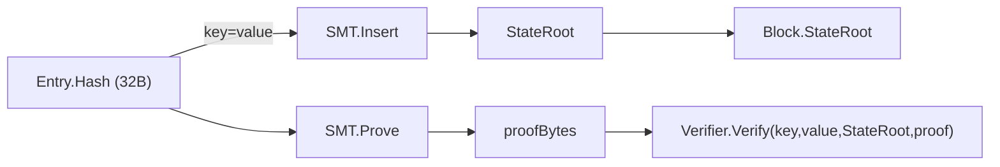

# Sparse Merkle Tree (SMT)

> **Document Level:** C — Protocol
>
> **Classification:** Normative
>
> **Status:** Draft
>
> **Protocol Version:** 1
>
> **Version:** 1.0
>
> **Source**
> - Specification: [`spec/3CP.md`](../../spec/3CP.md) §5
> - Implementation: `gleipnir-ipc/pkg/smt/smt.go`, `pkg/smt/smt_serialization.go`
> - Tests: `pkg/smt/smt_test.go`, `smt_property_test.go`, `smt_bench_test.go`
> - Schema: [`spec/schemas/smt.cddl`](../../spec/schemas/smt.cddl)

---

## Purpose

Define the Sparse Merkle Tree that commits to the set of all anchored entries
and enables third-party inclusion/exclusion proofs.

## Scope

SMT parameters, path determination, proof format, and verification (spec §5).
The SMT `StateRoot` is a field of every block ([anchoring](anchoring.md)).

## Parameters (spec §5.1)

| Parameter | Value |
|-----------|-------|
| Hash function | BLAKE3-256 |
| Depth | 256 |
| Leaf format | `BLAKE3("leaf" \|\| key \|\| value)`, key and value each 32 bytes |
| Parent format | `BLAKE3(left \|\| right)`, both 32-byte hashes |
| Empty hash | `BLAKE3("")` |
| Bit ordering | LSB-first within each byte of the key |

Implementation: `pkg/smt/smt.go` — `SparseMerkleTree` with `leafHash` (prefix
`"leaf"`) and `parentHash`.

## Data Structures

| Structure | Fields | Description |
|-----------|--------|-------------|
| `SparseMerkleTree` | `root [32]byte`, `depth int`, `store map`, `zeroes [][32]byte` | The tree; default depth 256 |
| Leaf | `key [32]byte`, `value [32]byte` | For anchored entries, `key = value = entry.Hash` |
| Proof | `[][32]byte` (n × 32 bytes) | Sibling path from leaf to root |

## Path Determination (spec §5.2)

```
For depth from 0 to 255:
    byteIdx = depth / 8
    bitIdx  = depth % 8
    bit     = (key[byteIdx] >> bitIdx) & 1
    If bit == 0: go left  (sibling is right)
    If bit == 1: go right (sibling is left)
```

> Implementation note: `pkg/smt/smt.go` `path(key, depth)` computes
> `key[depth/8] >> (depth%8)`. Confirm bit-endianness against a second
> implementation before claiming cross-implementation interoperability of raw
> proof bytes; the spec states LSB-first.

## Proof Format (spec §5.3)

An SMT proof is a sequence of 32-byte sibling hashes from leaf to root,
concatenated:

```
proofBytes = sibling[0] || sibling[1] || ... || sibling[n-1]   // each 32 bytes
```

For a non-existent key (proof of absence), the leaf hash is computed from the
zero value (all-zero key and value); the sibling path MUST recompute to the
current `StateRoot`.

## Verification (spec §5.4)

A verifier walks the proof from leaf to root:

1. Compute leaf hash `BLAKE3("leaf" || key || value)`.
2. For each depth 0..255: read the next 32-byte sibling, determine direction
   from the key bit (§5.2), compute parent
   (`BLAKE3(current || sibling)` if left, else `BLAKE3(sibling || current)`),
   set `current = parent`.
3. After 256 iterations, `current` MUST equal the claimed `StateRoot`.

Implementation: `Verify(key, value, root, proof)` in `pkg/smt/smt.go`
(exercised by conformance TC06). `Insert`, `Prove`, `Get`, `Root`, and
`BulkInsert` are the operational API.

## Data Flow



## Persistence

The tree is serialized (`pkg/smt/smt_serialization.go`) and stored in the
`smt` bucket of BoltDB; it is rebuilt on boot from the stored representation.
See [Section 03 — Storage](../03-gleipnir/storage.md).

## Performance

| Operation | Complexity | Notes |
|-----------|------------|-------|
| Insert | O(depth) = O(256) BLAKE3 ops | Per entry |
| Prove | O(depth) | Sibling collection |
| Verify | O(depth) | 256 BLAKE3 parent computations |

Benchmarks: `pkg/smt/smt_bench_test.go`. Concrete numbers are not asserted here.

## Failure Modes

| Failure | Symptom | Handling |
|---------|---------|----------|
| Proof does not recompute to StateRoot | Verification fails | Reject; entry not proven |
| Missing key on `Get` | `smt.ErrNotFound` | Use proof-of-absence semantics |
| Serialization corruption | Rebuild fails on boot | See disaster recovery |

## References

- [`spec/3CP.md`](../../spec/3CP.md) §5
- [`spec/schemas/smt.cddl`](../../spec/schemas/smt.cddl)
- [anchoring](anchoring.md), [cryptography](cryptography.md)
- [Section 03 — Storage](../03-gleipnir/storage.md)
