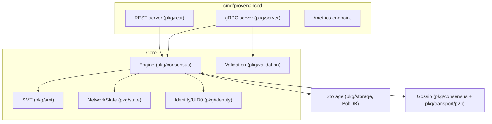

# Gleipnir Architecture

> **Document Level:** D — Implementation
>
> **Classification:** Reference Implementation
>
> **Status:** Draft
>
> **Version:** 1.0
>
> **Source**
> - Specification: [`spec/3CP.md`](../../spec/3CP.md)
> - Implementation: `gleipnir-ipc/` (`cmd/`, `pkg/`, `client/`)
> - Reference: `gleipnir-ipc/docs/BLUEPRINT.md`, `docs/ARCHITECTURE.md`, `README.md`

---

Per `DOCUMENTATION_SPEC.md` §9, this document describes responsibilities,
interfaces, dependencies, lifecycle, concurrency, persistence, communication
paths, trust boundaries, and failure domains.

## Purpose

Describe the architecture of Gleipnir, the Go reference implementation of 3CP,
and map every subsystem to its normative specification and detailed document.

## Scope

The whole Gleipnir codebase (`github.com/had-nu/gleipnir`, Go 1.25). Per-subsystem
detail is in the sibling documents in this section.

## Module Path and Layout

`github.com/had-nu/gleipnir`. Top-level directories:

| Path | Contents |
|------|----------|
| `cmd/provenanced/` | Validator daemon (gRPC + REST + metrics) |
| `cmd/provectl/` | Admin CLI (`init`, `health`, `root`, `submit`, `verify`) |
| `cmd/pipeline-sim/` | Load generator |
| `cmd/conformance-test/` | gRPC conformance suite (33 tests) |
| `pkg/chain/` | Protocol types: `Block`, `ProvenanceEntry`, `AnchorProof`, `Anchorer` |
| `pkg/consensus/` | Engine, VRF selection, quorum, gossip, rate limiter, sub-chains |
| `pkg/identity/` | UID0, Dilithium3, Kyber1024, ECVRF, BLAKE3, CBOR, contract binding |
| `pkg/smt/` | Sparse Merkle Tree |
| `pkg/state/` | `NetworkState`, Laplacian λ₁, supervision root |
| `pkg/storage/` | BoltDB backend |
| `pkg/transport/` | KEM handshake + AEAD; `p2p/` libp2p gossip + mDNS |
| `pkg/validation/` | Submission validation + error codes |
| `pkg/server/` | gRPC server + `api.proto` + generated `pb/` |
| `pkg/rest/` | REST API |
| `client/` | Go gRPC client library |
| `bench/` | Benchmark runner (`report.go`) |
| `deploy/` | `prometheus.yml` |

See [Section 06 — Repository Layout](../06-developer-guide/repository-layout.md)
for the full tree.

## Component Diagram

## Dependency Direction

`cmd/*` → `pkg/server`,`pkg/rest` → `pkg/consensus` → `pkg/smt`,`pkg/state`,
`pkg/identity`,`pkg/storage`,`pkg/validation`,`pkg/chain`. `pkg/transport`
provides gossip and secure channels to `pkg/consensus`. No import cycles;
`pkg/chain` holds shared types.

## Responsibilities

| Subsystem | Responsibility | Document |
|-----------|----------------|----------|
| Engine | Consensus cycle, submit/enqueue, anchor proofs | [engine](engine.md) |
| State | λ₁ supervision, node status, supervision root | [state-machine](state-machine.md) |
| Scheduler | Ticker-driven cycle loop | [scheduler](scheduler.md) |
| Storage | Persist/restore chain, SMT, state | [storage](storage.md) |
| gRPC API | Client-facing anchoring RPCs | [grpc-api](grpc-api.md) |
| REST API | HTTP anchoring surface | [rest-api](rest-api.md) |
| Metrics | `/metrics` endpoint (see gap) | [metrics](metrics.md) |
| Identity | UID0, signing, VRF | [engine](engine.md), spec §8 |

## Concurrency Model

- The engine runs a single goroutine `cycleLoop()` driven by a `time.Ticker`
  (`pkg/consensus/engine.go`).
- `RunCycle` holds a mutex and recovers from panics.
- gRPC/REST handlers call engine methods concurrently; the engine serializes
  state mutations under its lock.
- Storage writes occur on `Stop()` and after each committed block.

## Trust Boundaries

| Boundary | Trust root |
|----------|------------|
| Validator identity | UID0 signing keys (never exported) |
| Quorum | M-of-N Dilithium3 co-signatures |
| Client submission | Dilithium3 signature over the auth payload (spec §7.2.1) |
| Third-party verifier | Public chain only — no trust in the node |

## Failure Domains

See [threat-model](../01-introduction/threat-model.md) and
[Section 05 — Incident Response](../05-operations/incident-response.md).

## Implementation Status vs Specification

| Area | Status |
|------|--------|
| Consensus, SMT, VRF, UID0, gRPC (subset), REST, BoltDB, sub-chains | Implemented |
| Mandates (spec §13) | **Not implemented** |
| `StreamBlocks` | Declared, `Unimplemented` |
| Prometheus metrics | Endpoint mounted; **no metrics emitted** |
| Multi-node gossip in daemon | **Not wired**; tests only |
| Per-entry signature verification | Accepted, **not verified** |

## References

- [`spec/3CP.md`](../../spec/3CP.md)
- Sibling documents: [engine](engine.md), [state-machine](state-machine.md),
  [scheduler](scheduler.md), [storage](storage.md), [grpc-api](grpc-api.md),
  [rest-api](rest-api.md), [metrics](metrics.md), [deployment](deployment.md),
  [production](production.md), [troubleshooting](troubleshooting.md)
- [Section 06 — Repository Layout](../06-developer-guide/repository-layout.md)
