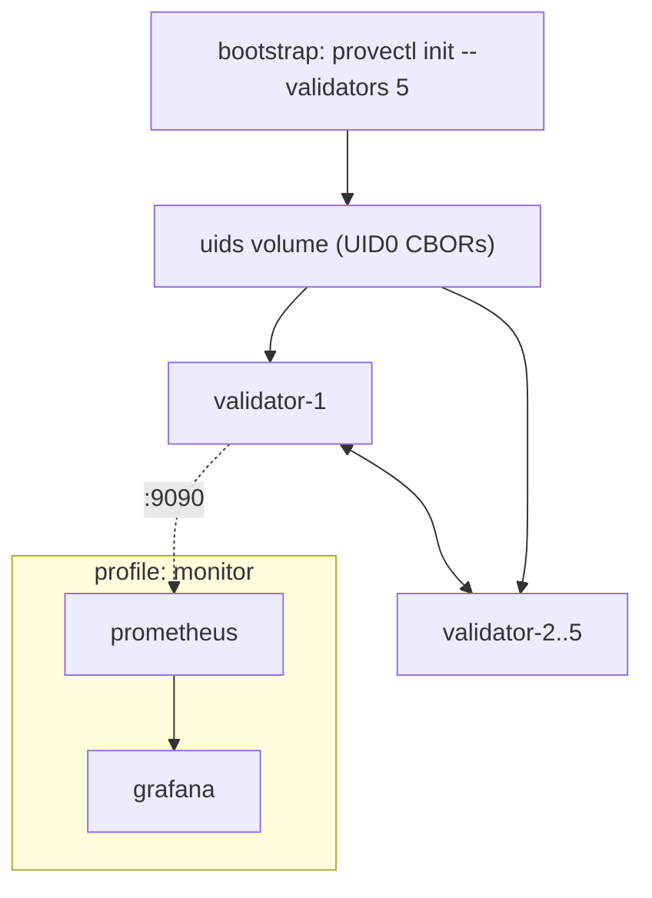

# Gleipnir Deployment

> **Document Level:** D/E — Implementation / Operational
>
> **Classification:** Reference Implementation
>
> **Status:** Draft
>
> **Version:** 1.0
>
> **Source**
> - Implementation: `gleipnir-ipc/Dockerfile`, `docker-compose.yml`, `docker-compose.sim.yml`, `docker-compose.test.yml`, `Makefile`, `cmd/provenanced/main.go`
> - Reference: `gleipnir-ipc/docs/ARCHITECTURE.md`

---

## Purpose

Document how Gleipnir is built and deployed: the container image, the
compose topologies, and the configuration surface.

## Scope

Build and container deployment artifacts. Cluster bootstrap procedure is in
[Section 05 — Cluster Bootstrap](../05-operations/cluster-bootstrap.md).

## Build

`Makefile` targets (selected):

| Target | Action |
|--------|--------|
| `all` | `proto` + `build` |
| `build` | Build `provenanced`, `provectl`, `pipeline-sim`, `conformance-test` |
| `proto` | Regenerate protobuf via `protoc` |
| `test` / `test-race` | `go test ./pkg/...` (with `-race`) |
| `check` | fmt + vet + lint + build + test + race |
| `docker-up` / `docker-down` | Start/stop the 5-validator compose |
| `docker-sim` | Start load generators |
| `docker-conformance` | Build 5-node net + run conformance |

## Container Image

`Dockerfile` — multi-stage:

1. `golang:1.25-alpine` builds `provenanced`, `provectl`, `pipeline-sim`,
   `conformance-test` with `CGO_ENABLED=0`.
2. `alpine:3.20` runtime; `EXPOSE 50051 9090`; `ENTRYPOINT ["provenanced"]`.

## Compose Topologies

| File | Purpose |
|------|---------|
| `docker-compose.yml` | 5-validator topology; a `bootstrap` service runs `provectl init --validators 5 --out /uids` to generate UID0 CBORs; `validator-1..5` mount `uids`+`data` volumes; optional `prometheus`/`grafana` under the `monitor` profile |
| `docker-compose.sim.yml` | Adds `pipeline-sim` load generators |
| `docker-compose.test.yml` | Overlay running `conformance-test` under the `test` profile |

## Configuration

`cmd/provenanced/main.go` reads flags with `IPC_*` env fallbacks:

| Flag | Env | Default | Notes |
|------|-----|---------|-------|
| `--grpc-port` | `IPC_GRPC_PORT` | 50051 | |
| `--metrics-port` | `IPC_METRICS_PORT` | 9090 | |
| `--uid-file` | `IPC_UID_FILE` | — | **Required** |
| `--node-id` | `IPC_NODE_ID` | — | **Required** |
| `--peers` | `IPC_PEERS` | — | Peer list |
| `--rest-listen` | `IPC_REST_LISTEN` | :8080 | |
| `--rest-tls-cert/key` | `IPC_REST_TLS_CERT/KEY` | — | Enable TLS |
| `--rest-keys-dir` | `IPC_REST_KEYS_DIR` | — | REST auth keys |
| `--rest-allowed-roots` | `IPC_REST_ALLOWED_ROOTS` | — | Whitelist |
| `--rest-rate-limit` | `IPC_REST_RATE_LIMIT` | 5000 | Per-minute |

There is **no config file**; configuration is flags + env only. `cycleInterval`
is hardcoded (3s). Full reference:
[Section 07 — Configuration Reference](../07-reference/configuration-reference.md).

## Ports

| Port | Service |
|------|---------|
| 50051 | gRPC |
| 8080 | REST |
| 9090 | `/metrics` (see [metrics](metrics.md) gap) |

## Implementation Divergence

> - `deploy/` contains only `prometheus.yml`; Kubernetes/Helm manifests
>   referenced in `docs/BLUEPRINT.md` are **not present**.
> - The compose topology generates UID0s per run via `provectl init`; the
>   daemon runs single-node consensus (libp2p gossip not wired).

## References

- [Section 05 — Cluster Bootstrap](../05-operations/cluster-bootstrap.md),
  [Rolling Upgrades](../05-operations/rolling-upgrades.md)
- [Section 07 — Configuration Reference](../07-reference/configuration-reference.md)
- [production](production.md), [metrics](metrics.md)
