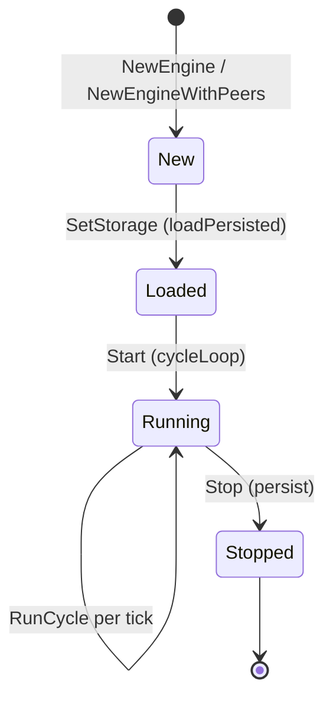

# Gleipnir Engine

> **Document Level:** D — Implementation
>
> **Classification:** Reference Implementation
>
> **Status:** Draft
>
> **Version:** 1.0
>
> **Source**
> - Specification: [`spec/3CP.md`](../../spec/3CP.md) §6
> - Implementation: `gleipnir-ipc/pkg/consensus/engine.go`, `node.go`, `cycle.go`, `quorum.go`, `gossip.go`, `triad.go`, `ratelimit.go`, `subchain.go`, `api.go`, `storage.go`
> - Tests: `pkg/consensus/consensus_test.go`, `consensus_multinode_test.go`, `consensus_liveness_test.go`, `consensus_adversarial_test.go`, `consensus_fuzz_test.go`

---

Per `DOCUMENTATION_SPEC.md` §10, this documents the engine's packages, public
and internal APIs, control flow, synchronization, persistent state, and
recovery logic.

## Purpose

Document the consensus engine — the core of Gleipnir that realises the 3CP
consensus cycle ([spec §6](../02-3cp-specification/consensus.md)).

## Scope

The `consensus` package, centred on `Engine`. Cryptographic primitives are in
`pkg/identity` ([cryptography](../02-3cp-specification/cryptography.md)); the
tree is in `pkg/smt` ([sparse-merkle-tree](../02-3cp-specification/sparse-merkle-tree.md)).

## The `Engine` Struct

Defined at `pkg/consensus/engine.go:19`. Key fields:

| Field | Type | Purpose |
|-------|------|---------|
| `node` | `Node` | Self identity (UID0) |
| `state` | `state.NetworkState` | λ₁, node status, supervision root |
| `st` | `*smt.SparseMerkleTree` | Current SMT |
| `blocks` | `[]chain.Block` | The chain |
| `pending` | `[]chain.ProvenanceEntry` | Submission queue |
| `anchored` | `map[[32]byte]*chain.AnchorProof` | Anchor proof index |
| `cycleInterval` | `time.Duration` | Tick interval |
| `nowFunc` | `func() time.Time` | Injectable clock (testability) |
| `gossip` | `GossipChannel` | Entry/proposal/sig/VRF dissemination |
| `peers` | `[]Peer` | Known validators |
| `subChains` | `*SubChainManager` | Sub-chain registry |
| `storage` | `EngineStorage` | Persistence backend |
| `rateLimiter` | `*SubmitterLimiter` | Per-submitter rate limiting |
| `quorumConfig` | `chain.QuorumConfig` | Threshold |

## Constructors

| Constructor | Location | Mode |
|-------------|----------|------|
| `NewEngine(node, cycleInterval)` | `engine.go:46` | Single-node |
| `NewEngineWithPeers(node, cycleInterval, gossip, peers)` | `engine.go:50` | Multi-node; registers full-mesh reputation edges |
| `newEngine` (internal) | `engine.go:70` | Defaults quorum 1/1 (single) or 3/3; builds SMT at `SMTDepth`; seeds self status 1.0 |

## Lifecycle

| Method | Location | Behavior |
|--------|----------|----------|
| `Start()` | `engine.go:108` | Launches `go e.cycleLoop()` |
| `Stop()` | `engine.go:113` | Sets stopped, cancels context, `persist()` |
| `SetStorage(s)` | `engine.go:125` | Attaches backend, calls `loadPersisted()` |
| `persist()` | `engine.go:136` | Serialize state, pending, anchored, blocks, SMT |
| `loadPersisted()` | `engine.go:153` | Restore all of the above on boot |

## Consensus Cycle — `RunCycle`

`RunCycle` at `pkg/consensus/engine.go:292` implements
[spec §6](../02-3cp-specification/consensus.md):

1. Lock; recover from panics.
2. `alpha = makeAlpha(cycle, stateRoot)` = `cycle || stateRoot` (`engine.go:315`).
3. Local VRF proof `node.UID.VRFProve(alpha)` (`engine.go:316`); gossip via
   `PublishVRFProof` (`engine.go:324`).
4. Collect proofs; `SelectProposer` → lowest Gamma (`engine.go:343`).
5. Proposer collects entries (gossip `Snapshot()` or local `pending`), dedups,
   builds `chain.Block` (`engine.go:391`), inserts each entry into the SMT and
   computes per-entry `AnchorProof` (`engine.go:407`–429).
6. `computeBlockHash` → SHA-256 (`engine.go:433`, `engine.go:654`).
7. Proposer signs with `SignDilithium`, broadcasts; non-proposers replicate SMT
   inserts and **verify local root == `block.StateRoot`** (`engine.go:484`),
   then co-sign.
8. Collect M-of-N signatures (`engine.go:498`).
9. `state.Apply(...)` (`engine.go:518`), append block, persist (`engine.go:529`).

## Public API (selected)

| Method | Location | Purpose |
|--------|----------|---------|
| `Enqueue` | `engine.go:182` | Add entry to pending |
| `Submit` | `engine.go:592` | Implements `chain.Anchorer` |
| `LookupHash` | `engine.go:205` | Anchor proof by hash |
| `VerifyHash` | `engine.go:626` | Is a hash anchored |
| `GetStateRoot` | `engine.go:250` | Current SMT root |
| `WaitForAnchor` | `engine.go:556` | Polls every 100ms until anchored |
| `GetHealth` | `engine.go:215` | Health snapshot |
| `GetBlock` / `BlockCount` / `Cycle` | `engine.go:263`/`272`/`257` | Chain accessors |
| `ProveSMT` | `engine.go:584` | SMT proof for a key |
| `SubChains()` | `engine.go:575` | Sub-chain manager |

## Concurrency and Synchronization

- Single `cycleLoop()` goroutine (`engine.go:278`) with `time.NewTicker`.
- `RunCycle` holds the engine mutex; API methods lock as needed.
- `nowFunc` allows deterministic clock injection in tests.
- Panic recovery inside `RunCycle` prevents a single bad cycle from crashing the
  daemon.

## Persistent State and Recovery

State, pending, anchored, blocks, and the SMT are serialized to BoltDB via
`EngineStorage` and restored by `loadPersisted()` on boot. See
[storage](storage.md).

## Failure Modes

| Failure | Symptom | Recovery |
|---------|---------|----------|
| Panic in cycle | Recovered; cycle skipped | Next tick retries |
| No valid proposer | `ErrVRFSelectionFailed` | New VRF round next tick |
| Quorum not met | Block dropped | Retry with more peers |
| Persist failure | Commit incomplete | Recover on restart |

## Implementation Divergence

> - Multi-node path (`NewEngineWithPeers` + libp2p gossip) is **not wired** into
>   the shipped daemon; the daemon uses `NewEngine` (single-node).
> - Explicit `VerifyQuorum` assertion is invoked by the multi-node test harness;
>   `RunCycle` collects signatures inline.
> - Per-entry `Signature` is not verified in the engine.
> - Mandate handling is absent.

## References

- [spec §6 — consensus](../02-3cp-specification/consensus.md)
- [state-machine](state-machine.md), [scheduler](scheduler.md),
  [storage](storage.md)
- [Section 06 — Extending the Engine](../06-developer-guide/extending-the-engine.md)
