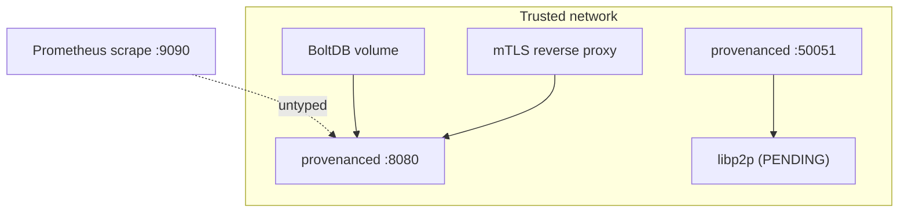

# Gleipnir Production Hardening

> **Document Level:** E — Operational
>
> **Classification:** Reference Implementation
>
> **Status:** Draft
>
> **Version:** 1.0
>
> **Source**
> - Implementation: `gleipnir-ipc/README.md`, `docs/ARCHITECTURE.md`, `deploy/`, `cmd/provenanced/main.go`
> - Operational: [`3CP_Operational_Playbook.md`](../../3CP_Operational_Playbook.md)
> - Reference: `gleipnir-ipc/docs/internal/PRD-ATP.md`

---

## Purpose

Document the production-readiness posture of Gleipnir: what is hardened, what is
missing, and the operational controls operators must apply.

## Scope

Security controls, high-availability posture, and the gap analysis that gates a
production deployment. Day-2 operations are in
[Section 05 — Operations](../05-operations/).

## Security Controls (present)

| Control | Where | Notes |
|---------|-------|-------|
| Dilithium3 auth (gRPC + REST) | `pkg/server`, `pkg/rest` | Per-request signature verification |
| REST TLS | `cmd/provenanced` | Optional; warns on plaintext |
| 30s timestamp skew window | `pkg/rest/server.go:255` | Replay protection for REST |
| BoltDB schema versioning | `pkg/storage/bolt.go:69` | `migrate()` guards format |
| CORS allowlist | `pkg/rest/server.go:177` | Configurable |

## High Availability Posture

> **Important — single-node consensus.**
>
> libp2p gossip is **not wired** into `provenanced`; the engine's `RunCycle`
> only drives a **single-node** block proposal and commit. The 5-node compose
> topology deploys 5 independent daemons that each run their own chain — they do
> **not** replicate or reach consensus with one another.
>
> Consequently Gleipnir does **not yet provide** fault-tolerant BFT
> replication. Do not rely on multiple validators for availability or safety
> until the libp2p gossip layer is integrated and validated. See
> [Section 04 — Divergence](../04-divergence/overview.md).

## Operational Controls (operator-applied)

| Control | Guidance |
|---------|----------|
| Network | Restrict 50051/8080 to trusted networks; front REST with mTLS reverse proxy |
| Secrets | UID0 CBORs are root credentials — store on encrypted volumes, restrict mounts |
| Backups | Schedule BoltDB backup per [backup](../05-operations/backup.md) |
| Monitoring | Poll `GetHealth`; `/metrics` instrumentation pending ([metrics](metrics.md)) |
| Rate limits | Set `--rest-rate-limit` to a sane per-minute cap |

## Deployment Topology

## Gap Analysis vs Spec

| Spec requirement | Status |
|------------------|--------|
| Multi-node BFT gossip (spec §6.1) | Not implemented |
| Mandates (spec §8) | Absent |
| StreamBlocks streaming (spec §7) | Unimplemented |
| Verified per-entry signatures | Accepted, not verified |
| Prometheus metrics (spec §11.3) | Endpoint mounted, no series |
| Self-healing supervision (spec §6.4) | λ₁ computed; no failover |

## Migration Path

The upgrade and rollback procedure for a future multi-node release is in
[Section 05 — Rolling Upgrades](../05-operations/rolling-upgrades.md).

## References

- [Section 04 — Divergence](../04-divergence/overview.md)
- [Section 05 — Security](../05-operations/security.md),
  [Observability](../05-operations/observability.md),
  [Backup](../05-operations/backup.md)
- [metrics](metrics.md), [deployment](deployment.md)
