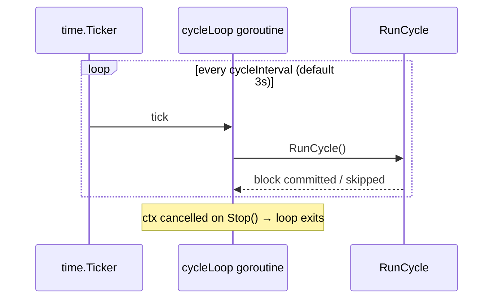

# Gleipnir Scheduler

> **Document Level:** D — Implementation
>
> **Classification:** Reference Implementation
>
> **Status:** Draft
>
> **Version:** 1.0
>
> **Source**
> - Specification: [`spec/3CP.md`](../../spec/3CP.md) §6.1, §6.4
> - Implementation: `gleipnir-ipc/pkg/consensus/engine.go` (`cycleLoop`), `pkg/server/server.go`

---

## Purpose

Document how consensus cycles are scheduled and how λ₁ recomputation is timed.

## Scope

The ticker-driven cycle loop and the periodic λ₁ recomputation gate. There is no
separate scheduler package; scheduling is inline in the engine.

## Cycle Loop

`cycleLoop()` at `pkg/consensus/engine.go:278` runs a single goroutine with a
`time.NewTicker(e.cycleInterval)`. On each tick it invokes `RunCycle`
([engine](engine.md)).

## Timing Parameters

| Parameter | Default | Source | Notes |
|-----------|---------|--------|-------|
| `cycleInterval` | 3s | `server.NewServer` (hardcoded) | Time between ticks |
| `LambdaInterval` | 10 cycles | `pkg/state/config.go` | λ₁ recompute cadence (**spec default 0**) |
| `WaitForAnchor` poll | 100ms | `engine.go:556` | Client-side anchor poll |

> Latency classification (`DOCUMENTATION_SPEC.md` §21): `cycleInterval` is a
> **consensus-latency** floor; a submission may wait up to one interval plus
> consensus time before anchoring. `WaitForAnchor` timeout guidance (spec §11.2)
> recommends at least `3 × cycleInterval` (default 9s).

## λ₁ Recomputation Gate

Inside `state.Apply`, λ₁ is recomputed every `LambdaInterval` cycles or when
`λ₁ == 0`. This bounds the CPU cost of power iteration to once per N cycles. See
[state-machine](state-machine.md).

## Shutdown

`Stop()` cancels the engine context; `cycleLoop` observes the cancellation and
exits, and `persist()` flushes state. See [engine](engine.md).

## Failure Modes

| Failure | Symptom | Handling |
|---------|---------|----------|
| Cycle overruns interval | Ticks may coalesce | Next tick runs after current cycle returns (single goroutine) |
| Panic in `RunCycle` | Recovered; cycle skipped | Loop continues on next tick |

## Implementation Divergence

> - `cycleInterval` is **not configurable via flag/env** in the shipped daemon;
>   it is hardcoded to 3s in `server.NewServer`.
> - `LambdaInterval` default (10) diverges from spec (0 = every cycle).

## References

- [engine](engine.md), [state-machine](state-machine.md)
- [spec §6.4 — cycle parameters](../02-3cp-specification/consensus.md)
