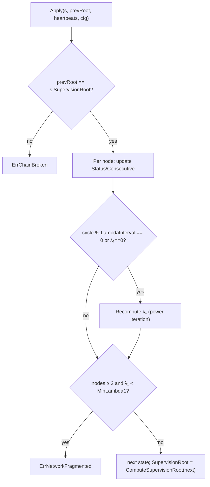

# Gleipnir State Machine

> **Document Level:** D — Implementation
>
> **Classification:** Reference Implementation
>
> **Status:** Draft
>
> **Version:** 1.0
>
> **Source**
> - Specification: [`spec/3CP.md`](../../spec/3CP.md) §6
> - Implementation: `gleipnir-ipc/pkg/state/state.go`, `apply.go`, `config.go`, `root.go`, `power_iter.go` (implied)
> - Tests: `pkg/state/state_test.go`, `power_iter_test.go`

---

## Purpose

Document Gleipnir's `NetworkState` machine: node status decay, Laplacian λ₁
supervision, and the supervision root that binds state transitions.

## Scope

The `state` package. The protocol-level state machine is in
[Section 02 — Protocol State Machine](../02-3cp-specification/protocol-state-machine.md);
the engine's cycle phases are in [engine](engine.md).

## Data Structures

| Type | Location | Fields |
|------|----------|--------|
| `NetworkState` | `state.go:6` | `Cycle uint64`, `Nodes map[string]NodeState`, `Graph ReputationGraph`, `Lambda1 float64`, `SupervisionRoot []byte` |
| `NodeState` | `state.go:14` | `UID`, `Status float64` (1.0 alive, decays), `Consecutive uint64`, `JoinCycle` |
| `ReputationGraph` / `Edge` | `state.go:21`/`25` | Weighted directed reputation edges |

All CBOR `keyasint`-tagged.

## Transition Function — `Apply`

`Apply(s, prevRoot, heartbeats, cfg)` at `pkg/state/apply.go:14`:

| Rule | Effect |
|------|--------|
| Node heartbeat this cycle | `Consecutive++`, `Status = 1.0` |
| No heartbeat | `Consecutive = 0`, `Status -= DecayRate` (floored at 0) |
| λ₁ recompute | Every `LambdaInterval` cycles or when `λ₁ == 0` |
| Fragmentation | `nodes ≥ 2` and `λ₁ < MinLambda1` → `ErrNetworkFragmented` |

## Configuration

`state.Config` (`config.go:4`):

| Field | Default | Notes |
|-------|---------|-------|
| `Eta` | 0.28 | Diffusion rate |
| `DecayRate` | 0.05 | Status decay per cycle |
| `MinLambda1` | 0.10 | Fragmentation threshold |
| `LambdaInterval` | 10 | λ₁ recompute cadence (**spec default is 0**) |
| `SMTDepth` | 256 | Tree depth |

## Supervision Root

`ComputeSupervisionRoot` (`root.go:16`): canonical CBOR of the partial state,
then BLAKE3-256. Each transition sets `SupervisionRoot` to the new value; the
next `Apply` rejects if `prevRoot` does not match — this chains state
transitions and detects tampering (`ErrChainBroken`).

## Laplacian λ₁

The Fiedler eigenvalue (second-smallest) of the network Laplacian, computed via
power iteration, measures diffusion health. Below `MinLambda1` signals possible
fragmentation. Tests: `pkg/state/power_iter_test.go`.

## Failure Modes

| Error | Cause | Handling |
|-------|-------|----------|
| `ErrChainBroken` | `prevRoot != SupervisionRoot` | State transition rejected |
| `ErrNetworkFragmented` | λ₁ below threshold with ≥2 nodes | Fail closed (SHOULD) |

## Implementation Divergence

> - No enumerated phase machine; state is data (`NetworkState`) mutated by
>   `Apply`. See
>   [protocol-state-machine](../02-3cp-specification/protocol-state-machine.md).
> - `LambdaInterval` default 10 vs spec 0.

## References

- [Section 02 — Protocol State Machine](../02-3cp-specification/protocol-state-machine.md)
- [engine](engine.md), [consensus](../02-3cp-specification/consensus.md)
