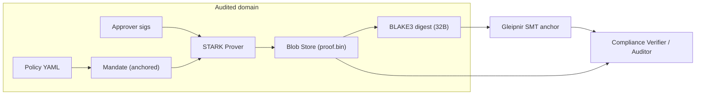

# Carcosa Architecture

> **Document Level:** D — Implementation
>
> **Classification:** Reference Implementation
>
> **Status:** Draft
>
> **Version:** 1.0
>
> **Source**
> - Design: [`CARCOSA.md`](../../CARCOSA.md), `carcosa/docs/ARCHITECTURE.md`
> - Implementation: `carcosa/` (Rust workspace: `air`, `cli`)
> - See also: [divergence — Carcosa](../04-divergence/carcosa.md)

---

## Purpose

Document Carcosa's intended architecture and what is implemented today,
clearly separating **as-built** from **planned**.

## Scope

The ZK-audit component. Carcosa binds a 3CP mandate to a Winterfell STARK that
proves threshold approval without revealing *who* approved (privacy), while the
mandate makes *omission* detectable.

## Intended Architecture

## As-Built

| Component | Status | Evidence |
|-----------|--------|----------|
| Winterfell AIR (`air/src/approval_air.rs`) | **Implemented** | `ApprovalAir` + transition constraints |
| Trace builder (`air/src/trace.rs`) | **Implemented** | `ApprovalTrace` (3-col, N-row) |
| CLI (`cli/src/main.rs` + commands) | **Implemented (stub)** | `prove/verify/anchor/audit/setup` print only |
| Prover (`winter-prover`) | **Not invoked** | `prove` command prints, no proof generated |
| Verifier | **Not invoked** | `verify` command prints, no proof checked |
| Blob store | **Planned** | `audit`/`verify` reference `output/blobs` (not written) |
| gRPC client to Gleipnir | **Planned** | `anchor`/`audit` print only |
| Mandate consumption | **Planned** | Depends on Gleipnir mandates ([divergence D2](../04-divergence/mandates.md)) |

## Dependencies

`air/Cargo.toml`: `winterfell 0.13`, `winter-air/prover/verifier/math 0.13`,
`blake3 1`, `serde`, `hex`. No `tonic`/gRPC crate present.

## Key Design Facts

- The AIR proves "≥ `threshold` authorized approvers with valid signatures"
  without revealing identities (the trace uses `has_valid_sig`/`is_authorized`
  flags, not the keys).
- 32-byte BLAKE3 of the proof blob is the only thing anchored on-chain
  (scalability/privacy).

## Planned Work

See [divergence — Carcosa](../04-divergence/carcosa.md) (D11, D12) and
[air](air.md), [proving](proving.md), [audit](audit.md).

## References

- [divergence — Carcosa](../04-divergence/carcosa.md)
- [CARCOSA.md](../../CARCOSA.md)
- [air](air.md), [proving](proving.md), [audit](audit.md),
  [anchor-integration](anchor-integration.md)
