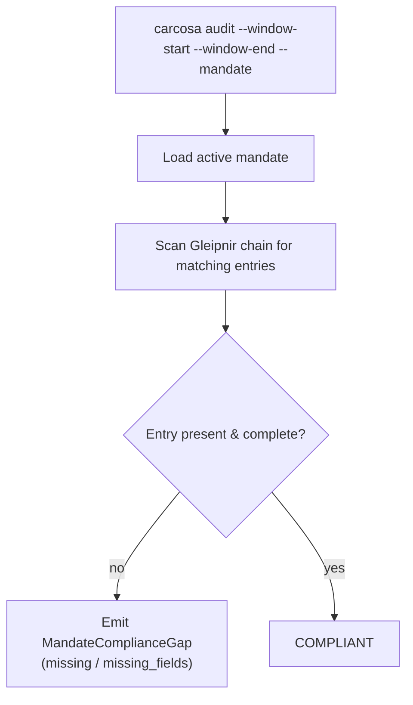

# Audit

> **Document Level:** D — Implementation
>
> **Classification:** Reference Implementation
>
> **Status:** Draft
>
> **Version:** 1.0
>
> **Source**
> - Implementation: `carcosa/cli/src/commands/audit.rs`
> - Design: `carcosa/docs/ARCHITECTURE.md` §3.3
> - Specification: [`spec/3CP.md`](../../spec/3CP.md) §13.5

---

## Purpose

Document the compliance-gap audit flow — what it should do and what the CLI
does today.

## Scope

Detection of `MandateComplianceGap` events (missing / missing_fields) against
active mandates. Consumed by external auditors.

## Designed Flow



Per spec §13.5, a gap is `missing` (no entry) or `missing_fields` (entry lacks
required fields). Carcosa's design labels these in PT-BR (`NAO ANCORADO`,
`omissao detectada`).

## As-Built

- **`carcosa audit`** (`audit.rs`): parses args and **prints a hardcoded
  non-compliance result**:
  ```
  [NO] COMPLIANCE GAP
    Mandato: <id> (release_gate, CVSS >= 7.0)
    Tipo:    missing
    Status:  NAO ANCORADO -- omissao detectada
  ```
  It does **not** load a mandate, scan the chain, or compute a real gap. The
  output is a demonstration scaffold, not a working auditor (D12).

## Dependencies

- Requires Gleipnir mandates ([divergence D2](../04-divergence/mandates.md)) to
  define what "complete" means.
- Requires a Gleipnir gRPC client (not yet implemented in Carcosa).

## Known Gaps

- No real chain scan; result is hardcoded.
- No `MandateComplianceGap` struct emitted.
- Language: demo output is PT-BR; final tooling should be configurable/i18n.

## References

- [spec §13.5](../02-3cp-specification/anchoring.md)
- [architecture](architecture.md), [proving](proving.md)
- [divergence D2](../04-divergence/mandates.md),
  [D12](../04-divergence/carcosa.md)
