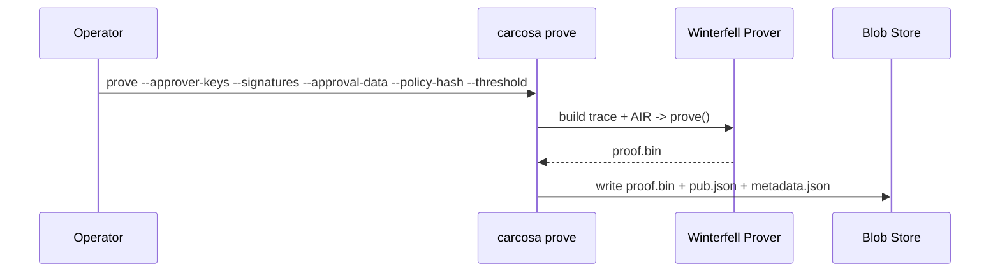

# Proving

> **Document Level:** D — Implementation
>
> **Classification:** Reference Implementation
>
> **Status:** Draft
>
> **Version:** 1.0
>
> **Source**
> - Implementation: `carcosa/cli/src/commands/prove.rs`, `air/Cargo.toml`
> - Framework: Winterfell 0.13

---

## Purpose

Document the proving flow — what is designed vs what the CLI currently does.

## Scope

STARK generation and the intended blob-store output. The AIR is in [air](air.md).

## Designed Flow

## As-Built

- **`carcosa prove`** (`prove.rs`): parses args and **prints** a success line.
  It does **not** invoke `winter_prover::prove`, does not build a real trace,
  and does not write `proof.bin`. Proving is **not implemented** (D11).
- **Blob store** (`output/blobs`): referenced by `--output` but never written.

## Winterfell Parameters (design estimate, `docs/ARCHITECTURE.md`)

| Param | Value |
|-------|-------|
| Security | 100 bits (post-quantum conjecture) |
| Extension field | QuadraticExtension |
| FRI folding factor | 4 |
| Proof size | ~70 KB (estimate) |
| Proving time | ~5–15s (estimate, laptop) |

> These are **design estimates from the Carcosa architecture doc**, not measured
> benchmarks. No proof has been generated to validate them.

## Known Gaps

- AIR public inputs do not bind `policy_hash`/`approval_data_hash`/`commitments`
  (see [air](air.md)) — a proof cannot yet be tied to specific policy/data.
- No prover invocation; the CLI is a scaffold.

## References

- [air](air.md), [architecture](architecture.md), [verification](verification.md)
- [divergence D11](../04-divergence/carcosa.md)
