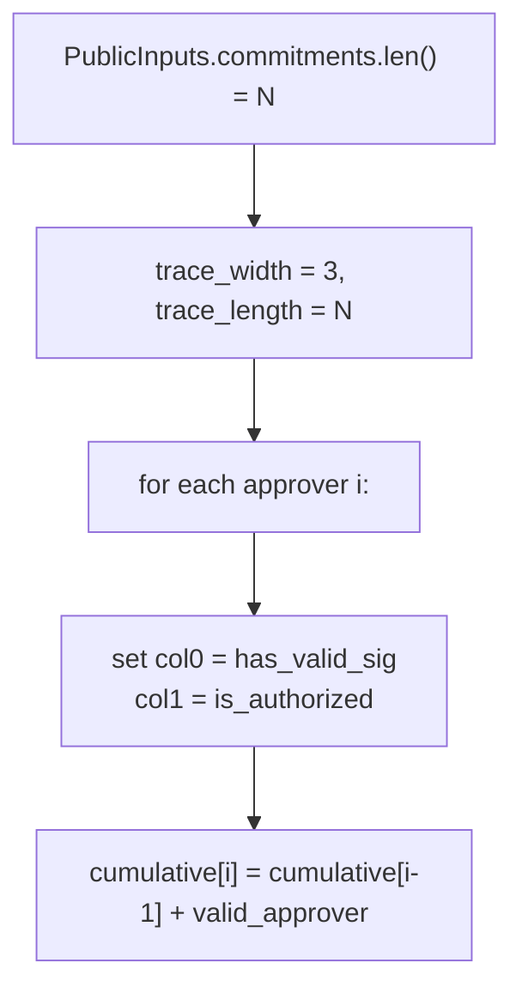

# Trace Generation

> **Document Level:** D — Implementation
>
> **Classification:** Reference Implementation
>
> **Status:** Draft
>
> **Version:** 1.0
>
> **Source**
> - Implementation: `carcosa/air/src/trace.rs`
> - Framework: Winterfell 0.13 (`winter_prover::TraceTable`)

---

## Purpose

Document the trace table construction for the approval AIR.

## Scope

`ApprovalTrace` in `air/src/trace.rs`. The constraint semantics are in
[air](air.md).

## Construction

- `TraceTable::new(3, N)` — 3 columns, one row per approver.
- `col0` = `has_valid_sig`, `col1` = `is_authorized`, `col2` = `cumulative`.
- `cumulative[0] = valid_approver[0]`; subsequent rows accumulate.

## As-Built Caveats

- `has_valid_sig` last row hardcoded to `0` (`trace.rs:19`) — placeholder.
- `is_authorized` hardcoded to `1` for all rows (`trace.rs:24`) — no real check.
- No signature verification feeds the trace (see [witness](witness.md)).

## Integrating with a Prover

A real prover would: build `PublicInputs`, run the witness logic
([witness](witness.md)) to set `has_valid_sig`/`is_authorized` correctly, then
call `winter_prover::prove(air, trace, options)`. This path is **not wired**
today (D11).

## References

- [air](air.md), [witness](witness.md), [proving](proving.md)
