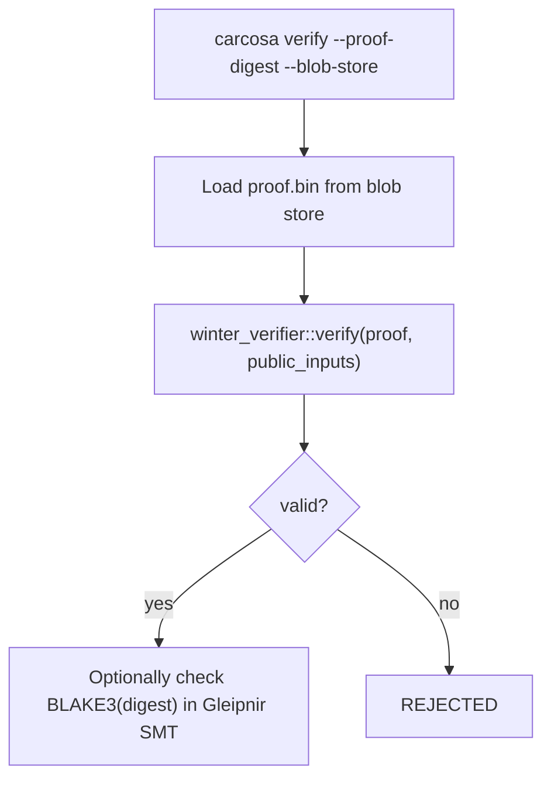

# Verification

> **Document Level:** D — Implementation
>
> **Classification:** Reference Implementation
>
> **Status:** Draft
>
> **Version:** 1.0
>
> **Source**
> - Implementation: `carcosa/cli/src/commands/verify.rs`
> - Framework: Winterfell 0.13 (`winter-verifier`)

---

## Purpose

Document the verification flow — what is designed vs what the CLI currently does.

## Scope

STARK proof verification and optional on-chain SMT inclusion check.

## Designed Flow

## As-Built

- **`carcosa verify`** (`verify.rs`): prints `[OK] STARK proof verified` and
  optionally `[OK] 3CP SMT inclusion verified (gleipnir: <addr>)` — purely
  cosmetic. It does **not** load a proof, does **not** call
  `winter_verifier::verify`, and does **not** query Gleipnir. Verification is
  **not implemented** (D11).

## Known Gaps

- No proof loading or verification; the public-input binding gap ([air](air.md))
  must be closed before a verifier can be meaningful.
- No Gleipnir gRPC client exists in Carcosa to perform the SMT inclusion check.

## References

- [air](air.md), [proving](proving.md)
- [anchor-integration](anchor-integration.md)
- [divergence D11](../04-divergence/carcosa.md)
