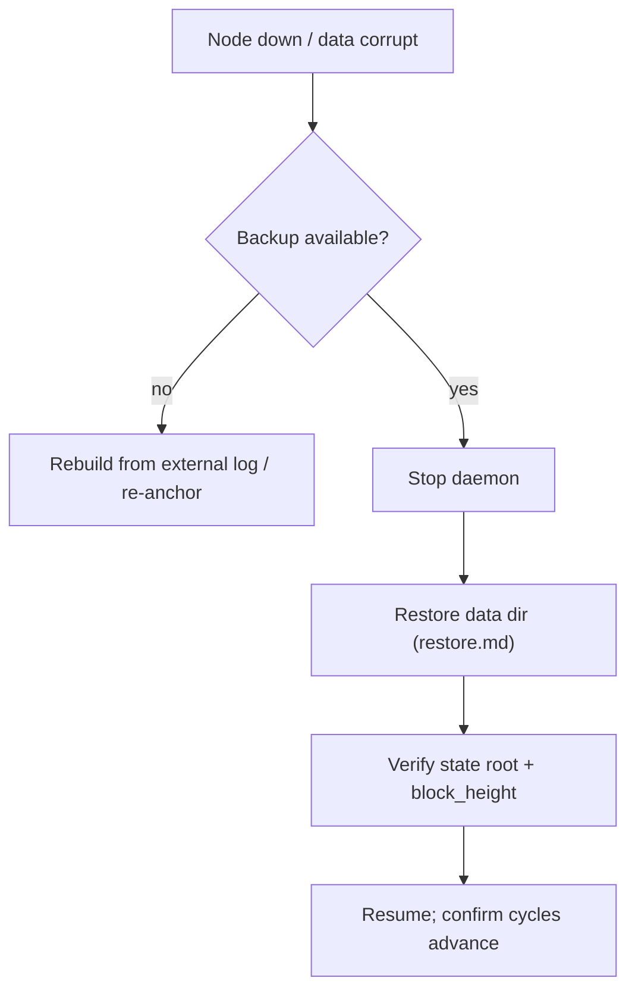

# Disaster Recovery

> **Document Level:** E — Operational
>
> **Classification:** Operational
>
> **Status:** Draft
>
> **Version:** 1.0
>
> **Source**
> - Operational: [`3CP_Operational_Playbook.md`](../../3CP_Operational_Playbook.md)
> - Implementation: [Section 03 — troubleshooting](../03-gleipnir/troubleshooting.md)

---

## Purpose

Recover from data corruption, lost node, or unrecoverable state.

## Scope

Node-level recovery. There is **no multi-node replication** (see
[divergence D3](../04-divergence/consensus.md)), so a single node is the only
source of truth — DR is backup-driven.

## RTO / RPO Posture

| Objective | Value | Basis |
|-----------|-------|-------|
| RPO | = backup frequency | No continuous replication |
| RTO | minutes to restore + verify | Single-node, BoltDB copy |

> No fabricated benchmarks — these are operational targets, not measured SLAs.

## Recovery Flow

## Scenarios

| Scenario | Recovery |
|----------|----------|
| BoltDB corruption | Restore latest good backup |
| `ErrChainBroken` | Restore earlier backup (see [restore](restore.md)) |
| Lost UID0 | Restore UID0 from secure backup; re-point `--uid-file` |
| Disk loss, no backup | Rebuild chain from external audit log if available; otherwise data lost |

## Prevention

- Schedule [backups](backup.md) at the required frequency.
- Monitor `block_height` stalls via [observability](observability.md).

## References

- [backup](backup.md), [restore](restore.md)
- [Section 03 — troubleshooting](../03-gleipnir/troubleshooting.md)
