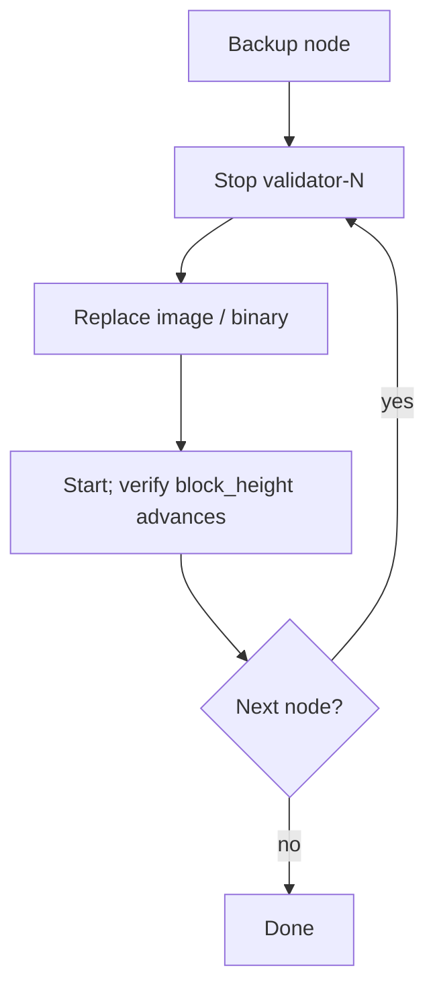

# Rolling Upgrades

> **Document Level:** E — Operational
>
> **Classification:** Operational
>
> **Status:** Draft
>
> **Version:** 1.0
>
> **Source**
> - Implementation: `gleipnir-ipc/Dockerfile`, `docker-compose.yml`
> - See also: [cluster-bootstrap](cluster-bootstrap.md)

---

## Purpose

Upgrade Gleipnir with minimal disruption.

## Scope

Daemon image/version rollout. Current topology has no quorum failover, so
"rolling" means sequential restart with backup safety.

## Pre-Upgrade

1. Take a [backup](backup.md).
2. Note `block_height` and `GetCurrentStateRoot`.
3. Confirm BoltDB `schemaVersion` compatibility of the new build.

## Procedure

Because nodes are independent (no shared state), upgrade one at a time. Order
does not matter for consensus (there is none today).

## Rollback

1. Stop the upgraded node.
2. Restore the pre-upgrade data dir ([restore](restore.md)).
3. Redeploy the previous image.

## Future (multi-node)

When libp2p consensus lands ([divergence D3](../04-divergence/consensus.md)),
rolling upgrades should respect the N−M quorum: never stop more than M−1
validators at once.

## References

- [backup](backup.md), [restore](restore.md)
- [Section 03 — deployment](../03-gleipnir/deployment.md)
