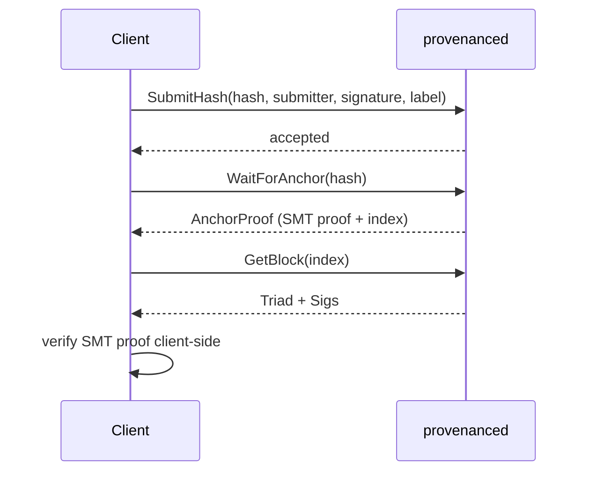

# Implementing a Client

> **Document Level:** D — Implementation
>
> **Classification:** Reference Implementation
>
> **Status:** Draft
>
> **Version:** 1.0
>
> **Source**
> - Implementation: `gleipnir-ipc/pkg/server/server.go`, `pkg/rest/server.go`
> - See also: [Section 03 — grpc-api](../03-gleipnir/grpc-api.md)

---

## Purpose

How to write a client that anchors a hash and verifies it.

## Scope

The canonical gate sequence over gRPC. REST mirrors the flow.

## Gate Sequence (spec §11.1)



## Step Detail

1. **Build the signature.** Dilithium3 over
   `hash || submitter || LE64(timestamp) || label` with the submitter's key.
2. **SubmitHash.** Set a `WaitForAnchor` timeout ≥ `3 × cycleInterval` (9s).
3. **WaitForAnchor.** Returns the `AnchorProof` (SMT membership proof + block
   index). The client polls internally at 100ms.
4. **GetBlock.** Fetch the full block to obtain the `Triad` and `Sigs`.
5. **Verify locally.** Recompute the SMT root from the proof and compare to
   `GetCurrentStateRoot`. This is the trust-minimized check.

## Error Handling

Map errors via [Section 07 — Error Reference](../07-reference/error-reference.md).
On `RATE_LIMITED`/`QUEUE_FULL`, back off and retry.

## Example (illustrative)

```text
# Illustrative — grpcurl-style; not a measured benchmark
grpcurl -d '{"hash":"<hex>","submitter":"<hex>","signature":"<hex>","timestamp":<unix>,"label":"ci:build-1234"}' \
  localhost:50051 provenance.ProvenanceAnchor/SubmitHash
grpcurl -d '{"hash":"<hex>"}' localhost:50051 provenance.ProvenanceAnchor/WaitForAnchor
```

## Notes

- `SubmitResponse.block_index`/`block_time` are 0 (see
  [divergence D6](../04-divergence/grpc-api.md)); learn placement from
  `WaitForAnchor` → `GetBlock`.
- `StreamBlocks` is unimplemented ([divergence D1](../04-divergence/grpc-api.md));
  poll `GetBlock` instead.

## References

- [Section 03 — grpc-api](../03-gleipnir/grpc-api.md),
  [rest-api](../03-gleipnir/rest-api.md)
- [Section 07 — Error Reference](../07-reference/error-reference.md)
