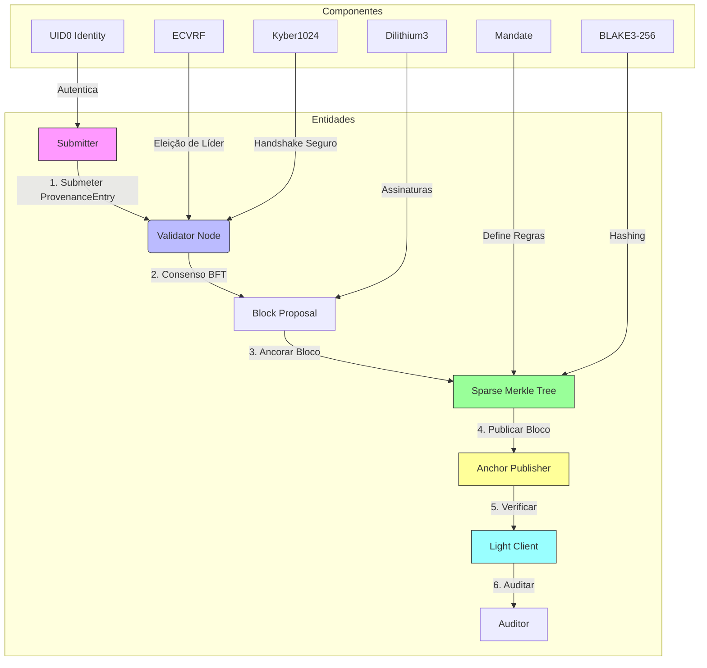
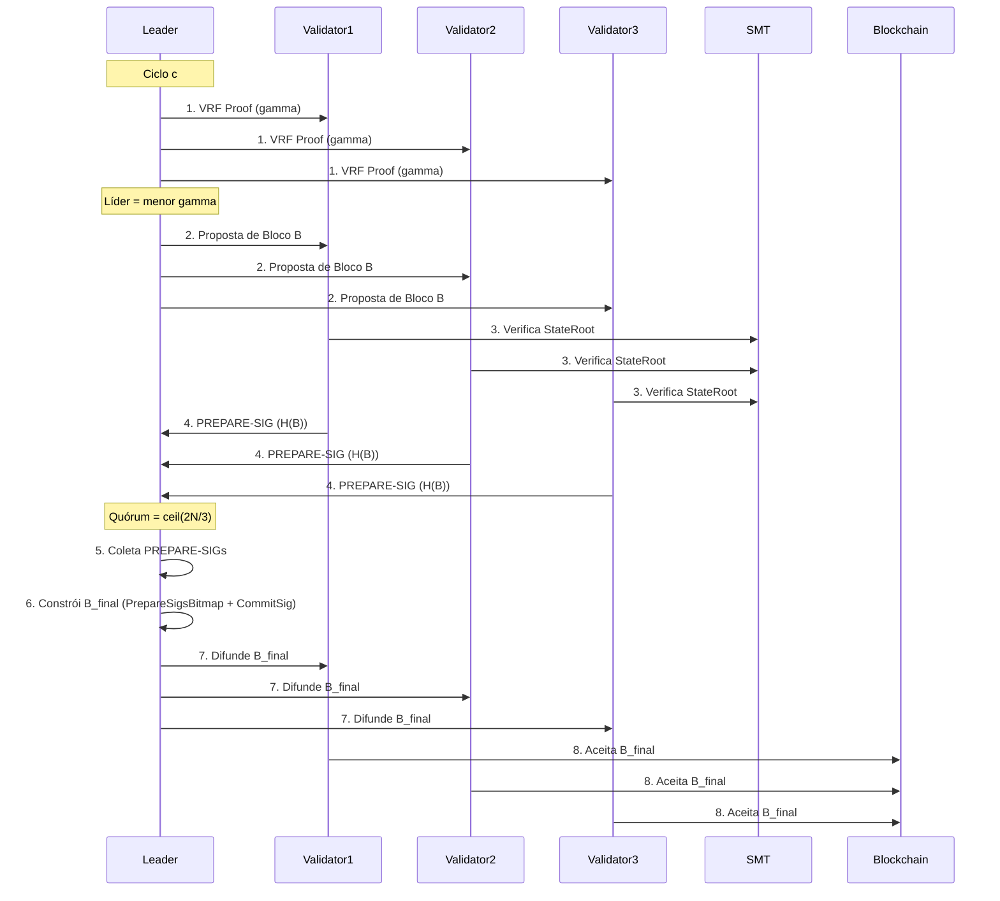
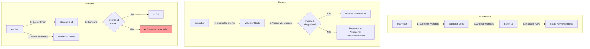
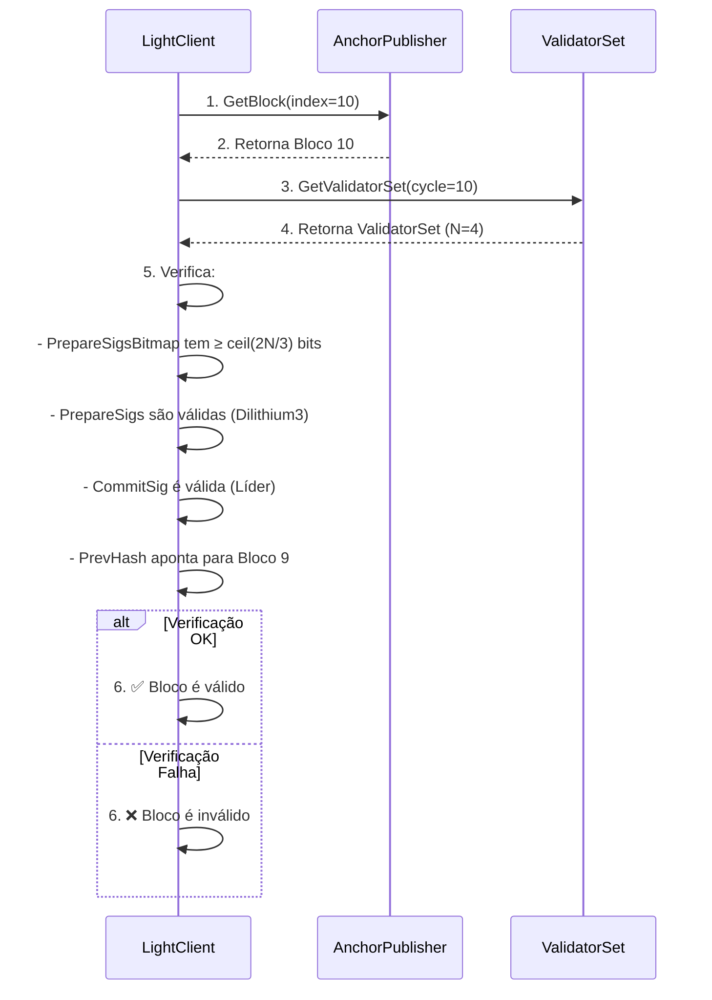
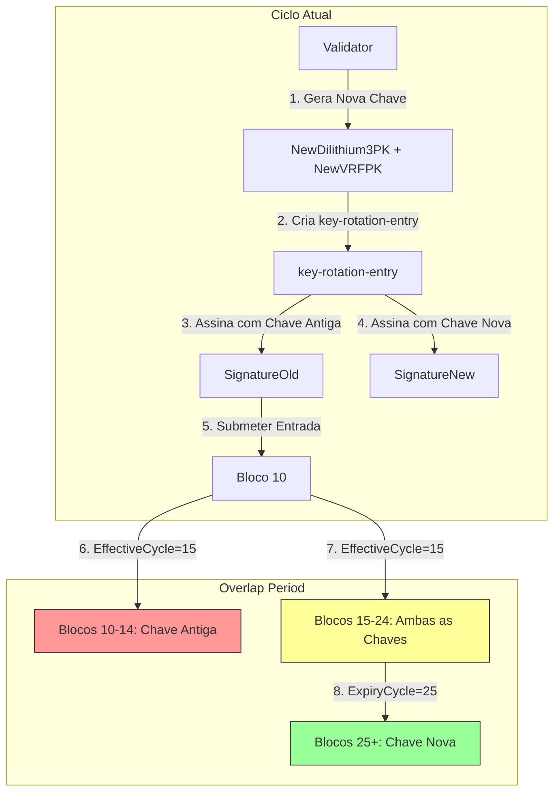

# Diagramas do 3CP

Este diretório contém **diagramas técnicos** do protocolo 3CP em formato **Mermaid.js**. 
Copie o código de cada diagrama e cole em [Mermaid Live Editor](https://mermaid.live/) para visualizar.

---

## 📌 1. Arquitetura Geral do 3CP
**Descrição:** Visão macro de como o 3CP funciona, mostrando entidades e componentes.



**Legenda:**
- **Submitter**: Quem submete dados (ex: um banco registrando uma transação).
- **Validator Node**: Nós que validam e assinam blocos (ex: Gleipnir).
- **Sparse Merkle Tree (SMT)**: Estrutura que armazena o estado da chain.
- **Anchor Publisher**: Publica blocos em IPFS/S3/filesystem.
- **Light Client**: Verifica blocos sem executar consenso.
- **Mandate**: Define quais eventos **devem** ser registrados.

---

## 📌 2. Fluxo de Consenso BFT (2 Fases)
**Descrição:** Como um bloco é produzido no 3CP v2.0, com eleição de líder via VRF e fases PREPARE/COMMIT.



**Detalhes:**
1. **Eleição de Líder**: Cada validador envia uma prova VRF (`gamma`). O líder é quem tem o menor `gamma`.
2. **Proposta**: Líder propõe um bloco `B` com entradas pendentes.
3. **Verificação**: Validadores verificam o `StateRoot` (raiz da SMT).
4. **PREPARE**: Validadores assinam `H(B)` e enviam para o líder.
5. **Quórum**: Líder espera `ceil(2N/3)` assinaturas.
6. **COMMIT**: Líder constrói `B_final` com `PrepareSigsBitmap` e `CommitSig`.
7. **Finalidade**: Bloco é **final e imutável**.

---

## 📌 3. Mandatory Event Anchoring (Inovação Principal)
**Descrição:** Como o 3CP detecta omissões de eventos obrigatórios.



**Explicação:**
1. **Mandate**: Um `ProvenanceEntry` com `Label: "3cp:mandate:v1"` define que eventos do tipo `"release_gate"` **devem** ser registrados.
2. **Evento**: Um submissor tenta registrar um evento (ex: uma aprovação de release).
3. **Validação**: O validador verifica se o evento **deve** ser ancorado (segundo os Mandates ativos).
4. **Ancoragem**: Se for obrigatório, o evento é ancorado no bloco.
5. **Auditoria**: O auditor compara a chain com os Mandates ativos. Se um evento obrigatório **não estiver** na chain, **a omissão é detectada**.

---

## 📌 4. Sparse Merkle Tree (SMT)
**Descrição:** Como o estado do 3CP é comprometido em uma SMT com profundidade 256.

```mermaid
flowchart TD
    subgraph Folhas
        A[Folha: key=hash1] -->|Hash| B[hash1_data]
        C[Folha: key=hash2] -->|Hash| D[hash2_data]
        E[Folha: key=hash3] -->|Hash| F[hash3_data]
    end
    
    subgraph Nós Intermediários
        direction TB
        B -->|BLAKE3| G[Nó 1: H\\hash1_data\\]
        D -->|BLAKE3| H[Nó 2: H\\hash2_data\\]
        F -->|BLAKE3| I[Nó 3: H\\hash3_data\\]
        G -->|BLAKE3| J[Nó 4: H\\G + H\\]
        I -->|BLAKE3| J
    end
    
    subgraph Raiz
        J -->|BLAKE3| K[StateRoot: H(J + ...)]
    end
    
    style K fill:#9f9,stroke:#333
```

**Detalhes:**
- **Folhas**: Cada folha é um `key=hash` do evento + `value=hash` do dado.
  - `key = entry.Hash` (32 bytes, BLAKE3-256)
  - `value = entry.Hash` (32 bytes, BLAKE3-256)
- **Nós Intermediários**: Hashes de 32 bytes (BLAKE3-256) dos filhos.
- **Raiz (StateRoot)**: Hash final da SMT, **incluído em cada bloco**.
- **Prova SMT**: Um array de **256 hashes** (8KB) para verificar inclusão.

---

## 📌 5. Light Client Verification
**Descrição:** Como um auditor verifica um bloco sem executar consenso.



**Passos:**
1. Obter o bloco do **Anchor Publisher** (IPFS, S3, filesystem).
2. Obter o **ValidatorSet** do ciclo do bloco.
3. Verificar **assinaturas** (quórum, líder, cadeia).

---

## 📌 6. Fluxo de Rotação de Chaves
**Descrição:** Como validadores trocam chaves sem downtime.



**Estrutura da `key-rotation-entry`:**
- `NewPublicKey` (Dilithium3)
- `NewVRFPublicKey`
- `EffectiveCycle` (ciclo em que a nova chave passa a valer)
- `ExpiryCycle` (ciclo em que a antiga chave expira)
- `SignatureOld` (assinada com a chave antiga)
- `SignatureNew` (assinada com a nova chave)

---

## 📌 7. Exemplo de Mandate (YAML)
```yaml
mandate:
  id: "M-RELEASE-GATE-v1"  # BLAKE3-256 do payload
  authority: "root:security-team"  # RootID do autor
  version: 1
  valid_from: "2026-01-01T00:00:00Z"
  valid_until: "2026-12-31T23:59:59Z"  # 0 = nunca expira
  rules:
    - event_class: "release_gate"
      description: "Toda release com CVSS >= 7.0 exige aprovação"
      severity_min: 7.0
      severity_max: 10.0
      mandatory: true  # DEVE ser registrado
      required_fields: ["Approver", "Signature", "CVSS"]
      max_deferral_sec: 30  # Janela máxima de tolerância
```

---

## 📌 8. Exemplo de ProvenanceEntry (JSON)
```json
{
  "Hash": "62e3391cf9506246869a9a2828517c2dff1cf60c5c3d41798e693905cd4db509",
  "Submitter": "4e4f44453030312d2d2d2d2d2d2d2d2d",
  "Timestamp": 1784030400000000000,
  "Label": "release:gate",
  "Approver": "5e4f44453030322d2d2d2d2d2d2d2d2d",
  "Reference": "a1b2c3d4e5f6...",
  "Signature": "d1e2f3a4b5c6...",
  "MandateRef": "a1b2c3d4e5f678901234567890123456789012345678901234567890"
}
```

---

## 🔗 **Como Usar Estes Diagramas**
1. **Visualização Online:**
   - Acesse [Mermaid Live Editor](https://mermaid.live/).
   - Copie e cole o código Mermaid.
   - O diagrama será renderizado automaticamente.

2. **Integração em Documentos:**
   - **Markdown (GitHub, GitLab):** Use bloco de código ```mermaid.
   - **LaTeX:** Use o pacote `mermaid` ou converta para TikZ.
   - **HTML:** Inclua a biblioteca Mermaid.js e use a tag `<div class="mermaid">`.

3. **Ferramentas Locais:**
   - **VS Code:** Instale a extensão [Mermaid](https://marketplace.visualstudio.com/items?itemName=bierner.markdown-mermaid).
   - **Obsidian:** Habilite o plugin Mermaid.

---

**Dica:** Para diagramas complexos, use o [Mermaid Live Editor](https://mermaid.live/) para ajustar o layout antes de incluir no whitepaper.
