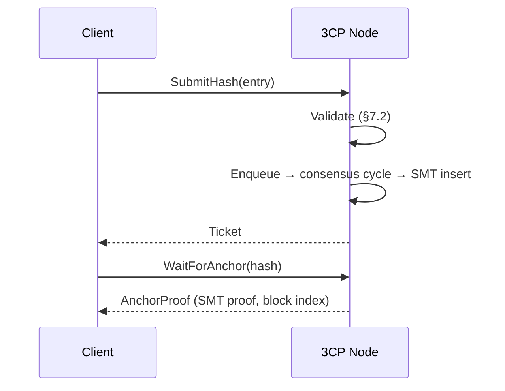

# Anchoring, Blocks, and Mandates

> **Document Level:** C — Protocol
>
> **Classification:** Normative
>
> **Status:** Draft
>
> **Protocol Version:** 1
>
> **Version:** 1.0
>
> **Source**
> - Specification: [`spec/3CP.md`](../../spec/3CP.md) §4, §9, §13
> - Implementation: `gleipnir-ipc/pkg/chain/`, `pkg/consensus/engine.go`, `pkg/consensus/subchain.go`
> - Schemas: [`block.cddl`](../../spec/schemas/block.cddl), [`mandate.cddl`](../../spec/schemas/mandate.cddl), [`cross-chain.cddl`](../../spec/schemas/cross-chain.cddl)
> - Notes: [`spec/notes/mandatory-anchoring.md`](../../spec/notes/mandatory-anchoring.md)

---

## Purpose

Define the on-chain data model — blocks, provenance entries, quorum config,
sub-chains, and mandates — and how anchoring makes evidence and obligations
independently verifiable.

## Scope

Block and entry structures (spec §4), sub-chains and cross-chain proofs
(spec §9), and mandates (spec §13). Encoding is canonical CBOR
([cryptography](cryptography.md) §5).

## Block (spec §4.1)

CBOR with integer field keys.

| Key | Field | Type | Description |
|-----|-------|------|-------------|
| 0 | `Index` | uint64 | Sequential block number, increments by 1 |
| 1 | `PrevHash` | []byte(32) | BLAKE3-256 of previous `BlockHash`; zeros for genesis |
| 2 | `StateRoot` | []byte(32) | SMT root after this block's insertions |
| 3 | `Proposer` | []byte(16) | RootID of the proposer |
| 4 | `Triad` | [3][]byte | Reserved |
| 5 | `Anchored` | []ProvenanceEntry | Entries anchored in this block |
| 6 | `Lambda1` | float64 | λ₁ at block time |
| 7 | `Timestamp` | int64 | UnixNano at finalization |
| 8 | `Sigs` | [][]byte | Dilithium3 signatures (3309 bytes each) |
| 9 | `Validators` | [][]byte | Dilithium3 public keys (1952 bytes each) |
| 10 | `Quorum` | QuorumConfig | Threshold configuration |
| 11 | `BlockHash` | []byte(32) | SHA-256 per [cryptography](cryptography.md) §1.2 |

## ProvenanceEntry (spec §4.2)

| Key | Field | Type | Description |
|-----|-------|------|-------------|
| 0 | `Hash` | [32]byte | Anchored content-addressed hash |
| 1 | `Submitter` | []byte | RootID or caller identifier |
| 2 | `Timestamp` | int64 | UnixNano |
| 3 | `Label` | string | OPTIONAL, SHOULD be ≤ 256 bytes |
| 4 | `Approver` | []byte | OPTIONAL |
| 5 | `Reference` | []byte(32) | OPTIONAL, links a related entry |
| 6 | `Signature` | []byte(3309) | OPTIONAL Dilithium3 signature over entry content (§7.2.1) |
| 7 | `MandateRef` | []byte(32) | OPTIONAL, hash of the MandateEntry (§13) |

## QuorumConfig (spec §4.3)

| Key | Field | Type |
|-----|-------|------|
| 0 | `TotalValidators` | int |
| 1 | `RequiredSigs` | int |

Defaults: `{3, 3}` multi-node; `{1, 1}` single-node.

## Anchoring Flow



## Sub-Chains (spec §9)

Each service MAY register a sub-chain with its own isolated SMT, periodically
anchored into the parent via a cross-chain proof.

| Method | Description |
|--------|-------------|
| `Register(name, owner)` | Create a sub-chain with its own SMT |
| `Submit(id, entry)` | Submit an entry to a sub-chain's SMT |
| `Anchor(id)` | Flush pending, compute state root, enqueue anchor entry in parent |
| `Prove(id, entryHash)` | Generate a dual-Merkle cross-chain proof |
| `VerifyCrossChain(proof, parentRoot)` | Verify entry-in-subchain AND subchain-root-in-parent |

**CrossChainProof** fields (spec §9.2): `EntryHash`, `SubChainRoot`,
`SubChainProof`, `AnchorHash`, `AnchorBlock`, `ParentRoot`, `ParentProof`.

Implementation: `pkg/consensus/subchain.go` (`SubChainManager`).

## Mandates (spec §13)

A **Mandate** is a signed, versioned, anchored declaration of which event
classes require anchoring. A Mandate is itself a `ProvenanceEntry` (hash of its
`MandateEntry` CBOR) and inherits all 3CP guarantees.

### MandateEntry (spec §4.4)

| Key | Field | Type | Description |
|-----|-------|------|-------------|
| 0 | `MandateID` | [32]byte | BLAKE3-256 of canonical CBOR excluding `Signature` |
| 1 | `Authority` | [16]byte | RootID of the issuer |
| 2 | `Version` | uint64 | Monotonic version |
| 3 | `PrevVersion` | [32]byte | Previous MandateID; zeros for first |
| 4 | `ValidFrom` | int64 | UnixNano effective time |
| 5 | `ValidUntil` | int64 | UnixNano expiry; 0 = never |
| 6 | `Supersedes` | [32]byte | Replaced MandateID; zeros if none |
| 7 | `Rules` | []Rule | Anchoring requirements |
| 8 | `PolicyHash` | [32]byte | BLAKE3-256 of external policy document |
| 9 | `PolicyURI` | string | OPTIONAL policy URI |
| 10 | `Signature` | []byte(3309) | Dilithium3 signature by `Authority` over keys 0–9 |

### Rule (spec §4.4.1)

| Key | Field | Type |
|-----|-------|------|
| 0 | `EventClass` | string |
| 1 | `Description` | string |
| 2 | `SeverityMin` | float64 |
| 3 | `SeverityMax` | float64 |
| 4 | `AssetCriticalityMin` | uint |
| 5 | `RegulatoryScope` | []string |
| 6 | `Mandatory` | bool |
| 7 | `RequiredFields` | []string |
| 8 | `MaxDeferralSec` | uint64 |

### Lifecycle (spec §13.2)

```
1. Authority constructs a MandateEntry
2. Authority signs canonical CBOR of keys 0–9
3. SubmitMandate() → anchored as ProvenanceEntry, Label "3cp:mandate:v1"
4. At ValidFrom, active
5. At ValidUntil, expired (treated as inactive)
6. New version: set PrevVersion + Supersedes, increment Version
```

### Active Resolution (spec §13.3)

```
ValidFrom <= T < ValidUntil    (if ValidUntil > 0)
ValidFrom <= T                 (if ValidUntil == 0)
```

Highest `Version` with `ValidFrom <= T` wins per lineage.

### Compliance Verification (spec §13.4)

A verifier compares the chain against the active mandate set to detect gaps:
`missing` (expected event absent) and `missing_fields` (present but incomplete)
(spec §13.5). This is a verification-time function performed by an auditor, not
the network. It is the protocol's answer to the forensic indistinction problem
(see [`spec/notes/mandatory-anchoring.md`](../../spec/notes/mandatory-anchoring.md)).

### Sub-Chain Inheritance (spec §9.3)

A sub-chain resolves its active mandate set from the parent at registration
(anchored with `Label "3cp:mandate:inheritance:v1"`), MAY define its own
mandates, and sub-chain rules override parent rules with matching `EventClass`,
`SeverityMin`, `SeverityMax`.

## Implementation Divergence (Gleipnir)

> **Behavior not verified in the reference implementation.**
>
> | Spec feature | Gleipnir status |
> |--------------|-----------------|
> | `MandateEntry`, `Rule`, mandate endpoints (§4.4, §7.5, §13) | **Not implemented** — no mandate code exists in `pkg/` |
> | `ProvenanceEntry.MandateRef` (key 7) | Field defined in the model but not resolved/validated |
> | `ProvenanceEntry.Signature` (key 6) | Accepted but **not verified** server-side |
> | Sub-chains (§9) | Implemented in `pkg/consensus/subchain.go` but **not exposed via gRPC** |
> | Block serialization | Canonical CBOR per spec; storage layer uses JSON internally |
>
> The mandate-based omission-detection guarantee is therefore **not available**
> in a default Gleipnir deployment. Carcosa's audit design depends on it — see
> [Section 04 — Audit](../04-carcosa/audit.md).

## References

- [`spec/3CP.md`](../../spec/3CP.md) §4, §9, §13
- [`spec/schemas/`](../../spec/schemas/) — CDDL definitions
- [`spec/notes/mandatory-anchoring.md`](../../spec/notes/mandatory-anchoring.md)
- [consensus](consensus.md), [sparse-merkle-tree](sparse-merkle-tree.md)
